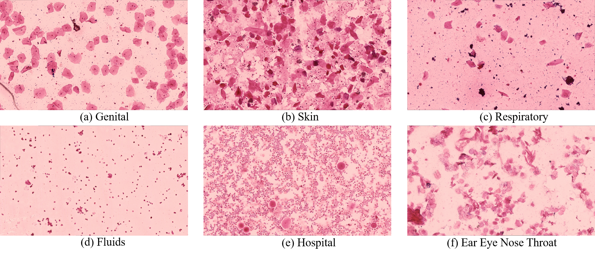

# SNPGram21 Dataset
This is the official repository for the SNPGram21 dataset introduced in the ICPR2022 paper: Efficient Cell Labelling for Gram Stain WSIs. 

# Dataset Creation
This dataset was constructed in collaboration with Sullivan Nicolades Pathology (SNP) from routine clinical samples. WSI samples are from 6 groups including Skin, Respiratory, Fluids, Hospital, Genital, and Ear/Eye/Nose/Throat. 
SNPGram21 includes 100 Whole Slide Gram Stain Images used in the clinical investigation of infections. The slides are automatically scanned without using oil immersion at 63 magnification. Each WSI TIFF file is compressed to JPEG format. Leukcytes and epithelial cells are annotated using bounding boxes.



# Download
The link to the current version of the dataset is available here: <p><a href=" https://doi.org/10.48610/afac7f6"> https://doi.org/10.48610/afac7f6</a></p>.

Folder (WSI) contains:
- Compressed 100 WSIs in JPEG format, and
- Their associated cell level bounding box annotations in separate '.Json' files

Folder (Tiles) contains:
- Cropped WSI 
- Cell level annotations of each of the tiles in '.csv' format


# Citation
Please cite the following paper when using this data for your research:
```latex
@INPROCEEDINGS{9956490,
  author={Alhammad, Sarah and Zhang, Teng and Zhao, Kun and Hobson, Peter and Jennings, Anthony and Lovell, Brian C.},
  booktitle={2022 26th International Conference on Pattern Recognition (ICPR)}, 
  title={Efficient Cell Labelling for Gram Stain WSIs}, 
  year={2022},
  volume={},
  number={},
  pages={4226-4233},
  doi={10.1109/ICPR56361.2022.9956490}}
```
